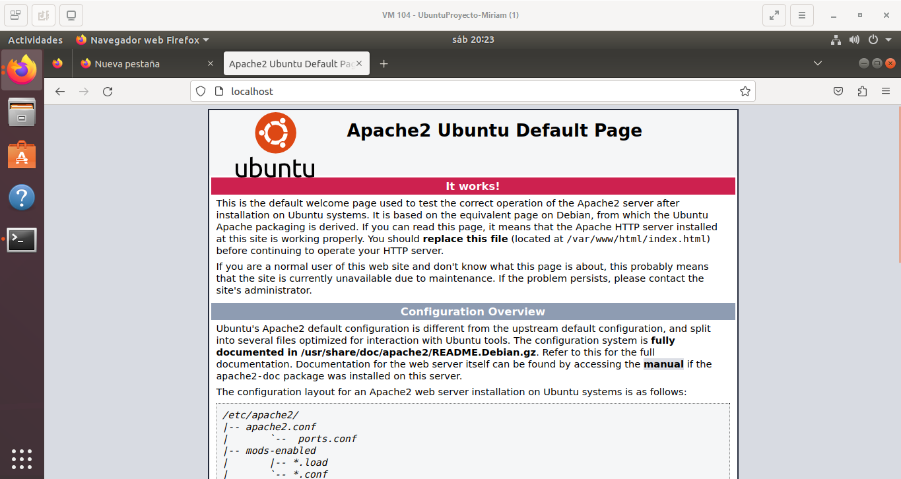
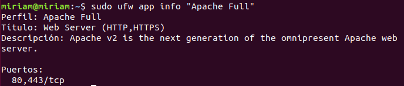
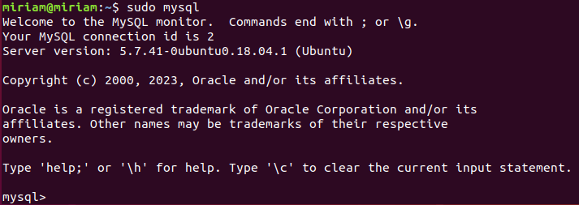
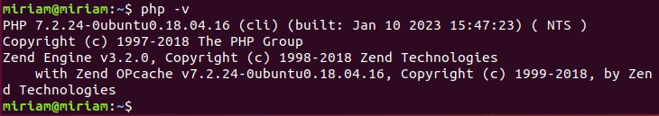

- Lo primero que debemos hacer es actualizar nuestro Ubuntu:

```bash
sudo apt update && sudo apt upgrade -y
```

- En segundo lugar instalamos `apache`:

```bash
sudo apt install apache2
```



- Una vez finalizada la instalación de `apache`, visualizamos la información:

```bash
sudo ufw app info "Apache Full"
```

 

- Luego instalamos `mysql`:

```bash
sudo apt install mysql-server
```



- Por último, instalamos `php`:

```bash
sudo apt install php libapache2-mod-php php-mysql
```



[Volver a la página principal](../README.md)
