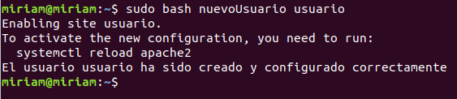
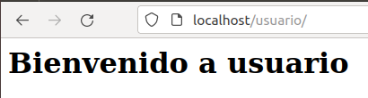
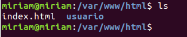
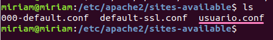
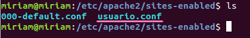

- Para realizar esta actividad, utilizamos el siguiente script:

```sh
#!/bin/bash

# Nombre del usuario
username=$1

# Comprobar si el usuario existe
if id "$username" >/dev/null 2>&1; then
  echo "El usuario ya existe"
  exit 1
fi

# Crear un usuario
useradd $username

# Establecer una contraseña para el usuario
echo "${username}:password" | chpasswd

# Crear un directorio personal para el usuario
mkdir /var/www/html/$username

# Establecer los permisos correctos para el directorio personal del usuario
chown -R $username:$username /var/www/html/$username
chmod 755 /var/www/html/$username

# Crear un archivo index.html en el directorio personal del usuario
cat << EOF > /var/www/html/$username/index.html
<html>
  <head>
    <title>Bienvenido a $username</title>
  </head>
  <body>
    <h1>Bienvenido a $username</h1>
  </body>
</html>
EOF

# Crear un archivo de configuración virtual host para el usuario
cat << EOF > /etc/apache2/sites-available/$username.conf
<VirtualHost *:80>
  ServerAdmin webmaster@localhost
  DocumentRoot /var/www/$username
  ServerName $username.local
  ErrorLog \${APACHE_LOG_DIR}/error.log
  CustomLog \${APACHE_LOG_DIR}/access.log combined
</VirtualHost>
EOF

# Habilitar el sitio virtual para el usuario
a2ensite $username.conf

# Reiniciar Apache
systemctl restart apache2

echo "El usuario $username ha sido creado y configurado correctamente"

```

- Lo probamos:

```bash
sudo bash nuevoUsuario usuario
```



- Reiniciamos `apache` y comprobamos que se ha creado todo correctamente:

```bash
systemctl reload apache2
```

- Abrimos el navegador e introducimos `http://localhost/usuario/`:



- Si nos movemos a la carpeta `/var/www/html` vemos que se ha creado correctamente:



- Y si nos movemos a la carpeta `/etc/apache2/sites-available` y `/etc/apache2/sites-enabled`, podemos ver los archivos de configuración:

 
