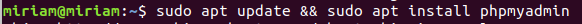
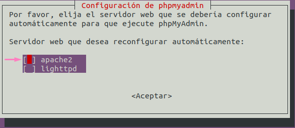
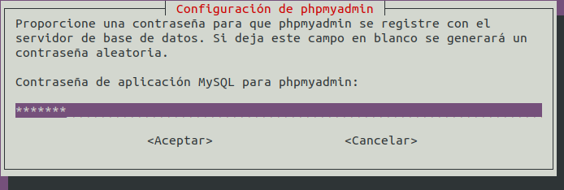
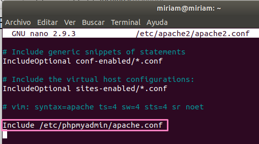
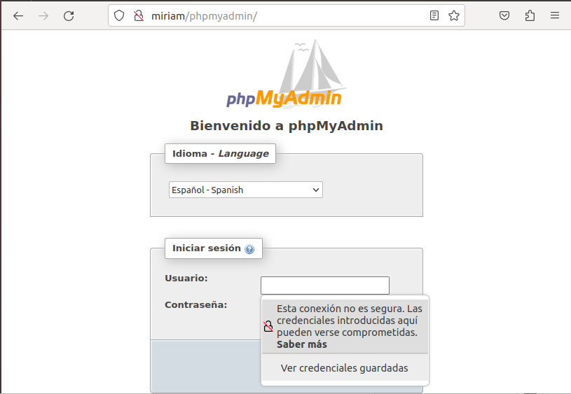
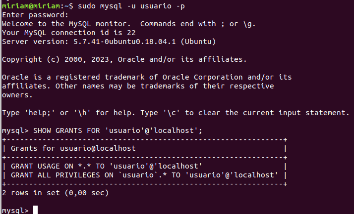

- Primero tenemos que instalar el paquete de `PHPMyAdmin`:

```bash
sudo apt update && sudo apt install phpmyadmin
```



- A continuación, nos saldrá la siguiente ventana donde tenemos que elegir `Apache`:



- Por último, nos pedirá introducir una contraseña:



- Una vez finalizada, debemos irnos al archivo de configuración `/etc/apache2/apache2.conf` y añadir la siguiente línea:

Include /etc/phpmyadmin/apache.conf



- Para probar que todo ha funcionado, nos vamos al navegador e introducimos la siguiente URL `http://miriam/phpmyadmin/`:



- Para terminar, he creado el siguiente script para crear una base de datos al usuario introducido por argumento:

```bash
#!/bin/bash

# Recuperar el nombre de usuario a través de un argumento
username=$1
password=$1

# Crear una nueva base de datos con el mismo nombre que el usuario
mysql -u root -p -e "CREATE DATABASE $username;"

# Verificar si la base de datos se creó correctamente
if [ $? -eq 0 ]; then
  echo "La base de datos ha sido creada correctamente."
else
  echo "Error al crear la base de datos."
fi

# Crear una nueva cuenta de usuario con el mismo nombre que la base de datos y configurar la contraseña
mysql -u root -p -e "CREATE USER '$username'@'localhost' IDENTIFIED BY '$password';"

# Verificar si la cuenta de usuario se creó correctamente
if [ $? -eq 0 ]; then
  echo "La cuenta de usuario ha sido creada correctamente."
else
  echo "Error al crear la cuenta de usuario."
fi

# Otorgar todos los privilegios sobre la nueva base de datos al usuario introducido
mysql -u root -p -e "GRANT ALL PRIVILEGES ON $username.* TO '$username'@'localhost';"

# Verificar si se otorgaron correctamente los privilegios
if [ $? -eq 0 ]; then
  echo "Se han otorgado los privilegios correctamente."
else
  echo "Error al otorgar los privilegios."
fi
```

- Voy a ejecutarlo introduciendo el usuario creado anteriormente para probar que funciona:



[Volver a la página principal](../README.md)
