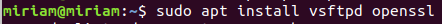
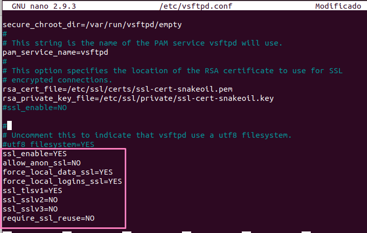
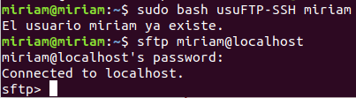

- Para permitir que los clientes accedan mediante `FTP` y gestionen sus archivos de manera segura mediante `TLS`, utilizamos el paquete `vsftpd` y `OpenSSL`.

```bash
sudo apt install vsftpd openssl
```




- Creamos un certificado `SSL/TLS` autofirmado utilizando `OpenSSL`:

```bash
sudo openssl req -x509 -nodes -days 365 -newkey rsa:2048 -keyout /etc/ssl/private/vsftpd.key -out /etc/ssl/certs/vsftpd.crt
```

> Este comando lo que hace es crear un certificado válido por 365 días, y generará un archivo de clave privada y un archivo de certificado público en los directorios `/etc/ssl/private` y `/etc/ssl/certs`, respectivamente.

- Editamos el archivo de configuración de `vsftpd` en `/etc/vsftpd.conf` y agregue las siguientes líneas:



> Estas líneas habilitan `SSL/TLS`, especifican las rutas a los archivos de certificado y clave, y configuran los protocolos y cifrados de `TLS` utilizados por `vsftpd`. 

- Reiniciamos `vsftpd` para aplicar los cambios:

```bash
sudo systemctl restart vsftpd
```

- Ahora configuramos el firewall para permitir conexiones `FTP` y `TLS`:

```bash
sudo iptables -A INPUT -p tcp --dport 20 -j ACCEPT
sudo iptables -A INPUT -p tcp --dport 21 -j ACCEPT
sudo iptables -A INPUT -p tcp --dport 990 -j ACCEPT
```

> Estos comandos permiten conexiones `FTP` activas y pasivas, y conexiones `TLS` a través de los puertos 20, 21 y 990.

- El siguiente script crea usuarios `FTP` con el nombre proporcionado, lo agrega al grupo de usuarios de `SSH` y modifica la configuración de `SSH` para permitir el acceso mediante `SFTP`.

```bash
#!/bin/bash

# Verificar si se ejecutó como root
if [ "$EUID" -ne 0 ]; then
  echo "Este script debe ejecutarse como root."
  exit
fi

# Verificar si se proporcionaron argumentos
if [ $# -eq 0 ]; then
  echo "Debe proporcionar al menos un usuario como argumento."
  exit
fi

# Nombre del usuario
username=$1

# Verificar que se haya proporcionado un nombre de usuario
if [ -z "$username" ]; then
    echo "Debe proporcionar un nombre de usuario."
    exit 1
fi

# Crear usuarios FTP
adduser $username
mkdir /home/$username/ftp
chown nobody:nogroup /home/$username/ftp
echo "$username" >> /etc/vsftpd.userlist
chmod 600 /etc/vsftpd.userlist

# Agregar el usuario al grupo de usuarios de SSH
usermod -aG ssh $username

# Modificar la configuración de SSH para permitir el acceso mediante SFTP
sed -i 's/Subsystem\tsftp\t\/usr\/lib\/openssh\/sftp-server/Subsystem\tsftp\tinternal-sftp/g' /etc/ssh/sshd_config

# Reiniciar el servicio SSH para que los cambios surtan efecto
systemctl restart ssh

```

- Ahora ejecutamos el script seguido el nombre del usuario e intentamos conectarnos con el servidor `sftp`:



[Volver a la página principal](../README.md)
