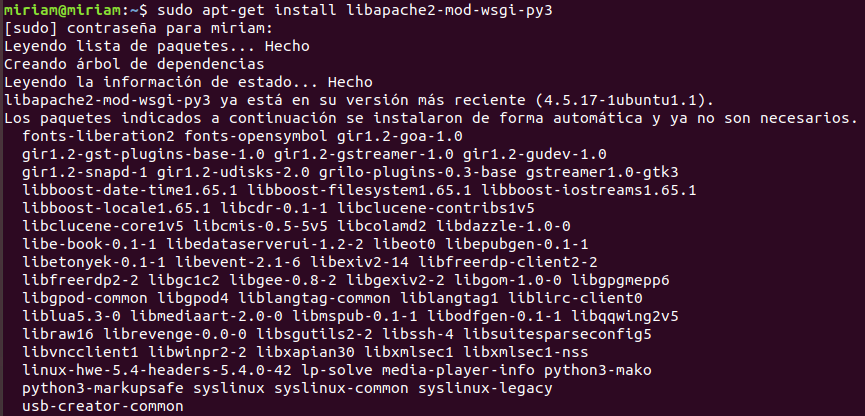
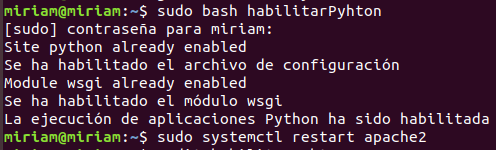
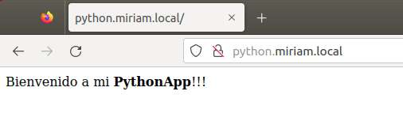

- Primero, debemos instalar el módulo `mod_wsgi`:

```bash
sudo apt-get install libapache2-mod-wsgi-py3
```



- Y ejecutamos el siguiente script:

```bash
##!/bin/bash

# Crear la carpeta "python" en /var/www/html
python_dir="/var/www/python"
if [ ! -d "$python_dir" ]; then
  sudo mkdir "$python_dir"
fi

# Crear el archivo de configuración
sudo tee /etc/apache2/sites-available/python.conf > /dev/null << EOF
<VirtualHost *:80>
    ServerAdmin admin@python.miriam.local
    ServerName www.python.miriam.local
    ServerAlias python.miriam.local
    DocumentRoot /var/www/python
    WSGIScriptAlias / $python_dir/python.py
    ErrorLog /error.log
    CustomLog /access.log combined

    <Directory $python_dir>
        Order allow,deny
        Allow from all
    </Directory>
</VirtualHost>
EOF

# Habilita el archivo de configuración
sudo a2ensite python.conf
echo "Se ha habilitado el archivo de configuración"

# Da permisos a las carpetas creadas
sudo chown -R www-data:www-data /var/www/python
sudo chmod -R 755 /var/www/python

#Habilita el módulo wsgi
sudo a2enmod wsgi
echo "Se ha habilitado el módulo wsgi"

# Reiniciar Apache
sudo service apache2 restart

# Crear el archivo "python.wsgi" en la carpeta /var/www/html/python
sudo tee "$python_dir/python.py" > /dev/null << EOF
def application(environ, start_response):
    status = '200 OK'
    output = b'Hello World!'

    response_headers = [
        ('Content-type', 'text/plain'),
        ('Content-Length', str(len(output)))
    ]

    start_response(status, response_headers)

    return [output]
EOF

echo "La ejecución de aplicaciones Python ha sido habilitada"
```

- Una vez ejecutado ya estaría habilitada:



- Por último, nos vamos al navegador e introducimos la url del dominio `http://python.miriam.local`:



[Volver a la página principal](../README.md)
