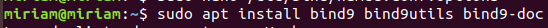
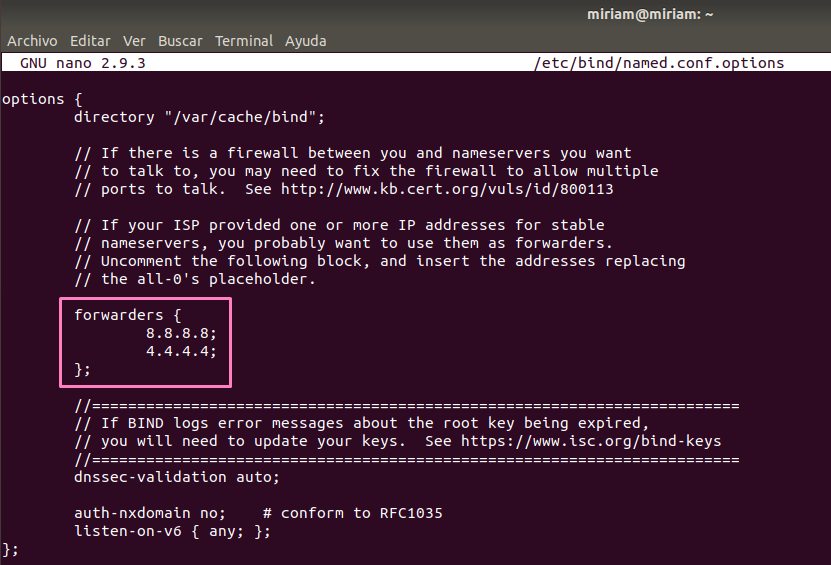
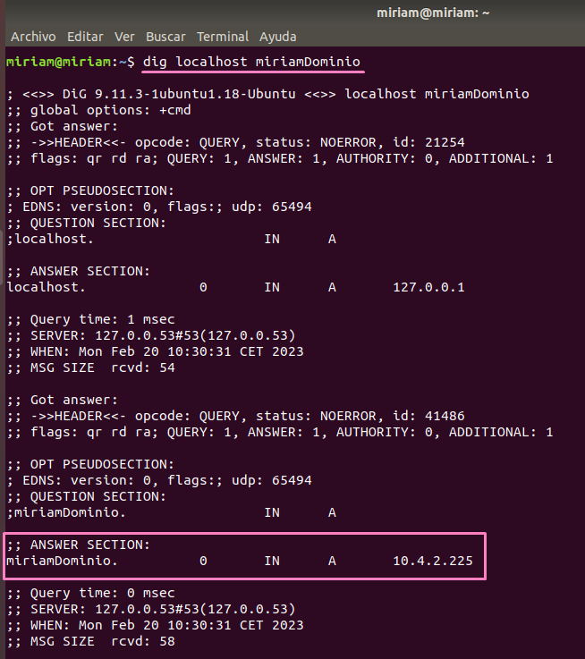
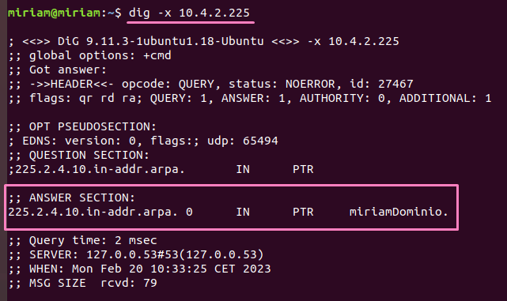
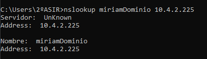

- Primero, instalamos el paquete `bind9` usando el siguiente comando:

```bash
sudo apt install bind9 bind9utils bind9-doc
```



- Una vez instalada,nos vamos al archivo de configuración `/etc/bind/named.conf.options` y editamos la siguiente línea:



- Reiniciamos el servicio:

```bash
sudo service bind9 restart
```

- Creamos el siguiente script:

```bash
#!/bin/bash

# Verificamos que se ejecute el script con permisos de root
if [ "$EUID" -ne 0 ]
  then echo "Por favor, ejecute como root"
  exit
fi

# Solicitar al usuario que ingrese el nombre de dominio
echo "Ingrese el nombre de dominio:"
read DOMINIO

# Solicitar al usuario que ingrese la dirección IP del servidor DNS
echo "Ingrese la dirección IP del servidor DNS:"
read IP_SERVIDOR

#Separa la ip del servidor
o1=$(echo $IP_SERVIDOR | cut -d. -f1).
o2=$(echo $IP_SERVIDOR | cut -d. -f2).
o3=$(echo $IP_SERVIDOR | cut -d. -f3).
o4=$(echo $IP_SERVIDOR | cut -d. -f4)

RUTA_ZONA_DIRECTA="/etc/bind/db.${DOMINIO}"
RUTA_ZONA_INVERSA="/etc/bind/db.$o3$o2$o1.in-addr.arpa"

# Creamos el archivo de zona directa
echo "\$TTL    604800
@       IN      SOA     ns.${DOMINIO}. root.${DOMINIO}. (
                          3         ; Serial
                     604800         ; Refresh
                      86400         ; Retry
                    2419200         ; Expire
                     604800 )       ; Negative Cache TTL
;
@       IN      NS      ns.${DOMINIO}.
ns      IN      A       ${IP_SERVIDOR}
www     IN      A       ${IP_SERVIDOR}
" > ${RUTA_ZONA_DIRECTA}

# Creamos el archivo de zona inversa
echo "\$TTL    604800
@       IN      SOA     ns.${DOMINIO}. root.${DOMINIO}. (
                          3         ; Serial
                     604800         ; Refresh
                      86400         ; Retry
                    2419200         ; Expire
                     604800 )       ; Negative Cache TTL
;
$o4       IN      PTR     ns.${DOMINIO}.
" > ${RUTA_ZONA_INVERSA}

# Añade las zonas a los archivos de configuración.
echo "include "/etc/bind/named.conf.options";
include "/etc/bind/named.conf.local";
include "/etc/bind/named.conf.default-zones";

zone "${DOMINIO}" {
        type master;
        file "${RUTA_ZONA_DIRECTA}";
};

zone "$o3$o2$o1.in-addr.arpa" {
        type master;
        file "${RUTA_ZONA_INVERSA}";
};

" > /etc/bind/named.conf

# Le damos permisos a los archivos de zona creados
chmod 640 ${RUTA_ZONA_DIRECTA}
chmod 640 ${RUTA_ZONA_INVERSA}

# Reiniciamos el servicio de Bind9
systemctl restart bind9

echo "Subdominio creado con éxito"
```

- Y por último, lo ejecutamos para comprobar que se ha creado correctamente.

> Desde el propio servidor:

- Zona directa:

```bash
dig localhost miriamDominio
```



- Zona inversa:

```bash
dig -x 10.4.2.225
```



>Desde un equipo cliente:



[Volver a la página principal](../README.md)
